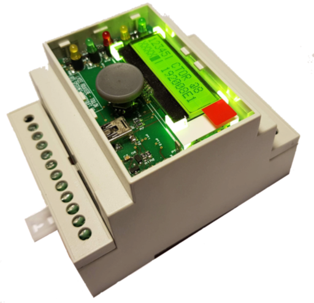
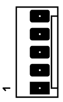

# Hmi4DinBox  
_Human-Machine Interface for Din Box_

## Features

Hmi4DinBox is a human-machine interface designed to be implemented on the front 
of a DIN rail enclosure.

 
  

Its features are as follows :   
* 5 leds,  
* a navigation button with (4 directions + 1 push button),  
* an 2x16 LCD display with a backlight (based on ST7032),  
* driven by a simple I2C bus and a binary signal `HIRQ` which indicates that one or 
more actions have been performed on the navigation button (key presses and 
releases in the 5 directions stored in a buffer),  
* powered by 5V or 3.3V allowing it to be driven by an Arduino board or Pi board,  
* USB programming interface compatible with Arduino IDE,  
* JTAG interface for programming the bootloader and debugging the firmware.

Published in open-source hardware, it comes with :  
* this Arduino library (also compatible with the [PiDuino](https://github.com/epsilonrt/piduino)),  
* [electronic schematic](extras/hardware/hmi4dinbox-sch.pdf),  
* [PCB layout](extras/hardware/hmi4dinbox-layout.pdf),  
* [manufacturing files](extras/hardware/gerber) and [Proteus CAD files](extras/hardware/proteus),  
* [Arduino bootloader and core](https://github.com/epsilonrt/duino-boards),  
* [firmware](extras/firmware).  

## How to connect your HMI to your board ?

The HMI is connected to your board by the 5-pin J1 MOLEX KK254 connector on the back of the PCB.

The pinout of the J1 connector is as follows :

| #   | Name    | Description                                                                           |
| :-: | :---:   | :----------------------------------------------------------                           |
| 1   | VCC     | 5V or 3.3V power supply, protected against overvoltages and polarity inversions       |
| 2   | SCL     | I2C clock, **no pull-up resistance on this line ! put one on the master board !**     |
| 3   | SDA     | I2C data, **no pull-up resistance on this line ! put one on the master board !**      |
| 4   | HIRQ    | Indicates that one or more actions have been performed on the navigation button       |                                                             |
| 5   | GND     | Ground                                                                                |

`HIRQ` is in the high state as long as there are unread actions in the buffer (capacity of 32 actions).
It goes low when all actions have been read with `key()`.

## How to install the library ?

This library allows the client-side control of the Hmi4DinBox connected by an I2C bus. 
It is intended to be used in an Arduino environment (also compatible with the 
[PiDuino library](https://github.com/epsilonrt/piduino) on Pi boards such as Raspberry Pi or NanoPi).

To install the library for Arduino IDE, simply download its 
[zip file](https://github.com/epsilonrt/Hmi4DinBox/archive/master.zip) and 
integrate it into your sketch according to 
[explanations on the Arduino site](https://www.arduino.cc/en/Guide/Libraries#toc4).

## How to use the HMI in your program ?

At the beginning of the file 
[Hmi4DinBox.h](src/Hmi4DinBox.h), 
we see the definition of constants describing the hardware solution:

    #define LED1 0
    #define LED2 1
    #define LED3 2
    #define LED4 3
    #define LED5 4

We have 5 leds, the numbering starts at 0.

    #define LED_RED LED1
    #define LED_GREEN1 LED2
    #define LED_GREEN2 LED3
    #define LED_YELLOW1 LED4
    #define LED_YELLOW2 LED5

We define more explicit constants corresponding to the colors of the leds: the 
led N° 1 is red, the N° 2 and 3 green ...

Then we find the constants for the keyboard function:

    #define KUP 1
    #define KDOWN 2
    #define KLEFT 3
    #define KRIGHT 4
    #define KCENTER 5

We have 5 keys corresponding to the 4 directions of the navigation button and 
the center button.

To use this HMI in a program, you must declare a global variable of type Hmi4DinBox:

    Hmi4DinBox hmi;

If one uses the navigation pad, it is necessary during this declaration to 
specify the number of pin Arduino used by the HMI to indicate that keys are in 
the internal buffer (it will thus be necessary to read them ...).

    const int hirqPin = 7;
    Hmi4DinBox hmi (hirqPin);

Then we can access:
* to the lcd function thanks to `hmi.lcd`,
* to the led function thanks to `hmi.led`,
* to the keyboard function thanks to `hmi.keyb`,
* the backlight function with `hmi.backlight`.

### Using LCD

The WireLcd class is derived from the Print class.
You can then use the `print()`, `println()`, `write()` functions:

    int i = 5;
    hmi.lcd.print("Helloworld ! ");
    hmi.lcd.println(i++);
    hmi.lcd.write('C');

To clear the screen:

    hmi.lcd.clear();

To move to the beginning of line 2:

    hmi.lcd.setCursor (1, 0);

To return to the top right:

    hmi.lcd.home();
    
To turn off the display:

    hmi.lcd.noDisplay();

To turn on the display:

    hmi.lcd.display();

To turn on the cursor:

    hmi.lcd.cursor();

To turn off the cursor:

    hmi.lcd.noCursor();

To enable cursor blinking:

    hmi.lcd.blink();

To disable cursor blinking:

    hmi.lcd.noBlink();
    
The contrast of the LCD can be changed, the value can vary from 0 to 63:

    hmi.lcd.setcontrast (24);

The contrast can also be read and adjusted in relation to the current value:

    byte c = hmi.lcd.getcontrast();
    hmi.lcd.adjcontrast (-1); // decrement the contrast value by 1

### Using leds

As can be seen in the sketch [LedDemo.ino](examples/LedDemo/LedDemo.ino):

    hmi.led.set (LED1);

turn on the LED1,

    hmi.led.clear (LED1);

turn off the LED1,

    hmi.led.toggle (LED1);

toggles the state of LED1,

    hmi.led.get (LED1);

read the state of the LED1,

The `hmi.led.writeAll ()` function allows you to modify all leds at the same time. 
By default, a call to this function without parameters turns on all leds.
If we pass him a parameter, that corresponds to the state of the leds. 
Bit 0 of this parameter is used to control LED1, bit 1, LED2 ...

### Using the keyboard

As can be seen in the sketch [KeyboardDemo.ino](examples/KeyboardDemo/KeyboardDemo.ino):

    hmi.keyb.available ()

to test if keys are available for reading,

    key = hmi.keyb.key ();

allows you to read the next key,

    hmi.keyb.released ()

lets you know if this key has been released and,

    hmi.keyb.pressed ()

if she was pressed.

### Using the backlight

As can be seen in the sketch [BacklightDemo.ino](examples/BacklightDemo/BacklightDemo.ino):

    hmi.backlight.write (bl);

allows to modify the value of the backlight (between 0 and 255), as this value 
is stored in EEPROM by the HMI, it is possible to read the current value thanks to:

    bl = hmi.backlight.read ();

------
